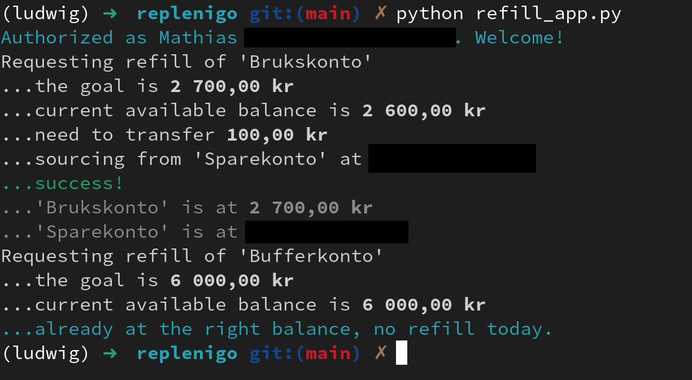

# replenigo
#### Script that utilizes Sbanken's Open Banking API to refill accounts to specified balances.



## Usage

> I recommend you to check out Sbanken's [developer portal](https://sbanken.no/bruke/utviklerportalen/) and read the [documentation](https://github.com/Sbanken/api-examples#swagger) for the Sbanken API before using this app

1. Retrieve credentials required to use the API at https://sbanken.no/bruke/utviklerportalen/

2. Install required packages defined in `requirements.txt` (e.g. with a virtual environment like `ludwig` below)
```shell
$ python -m venv ludwig
$ source ludwig/bin/activate
(ludwig) $ pip install -r requirements.txt
```

3. Use `config_template.py` to create your own `config.py` with required credentials, source account and refill parameters

4. Run the app:
```shell
(ludwig) $ python refill_app.py
```
